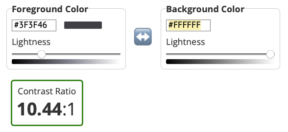
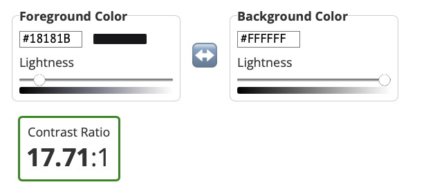
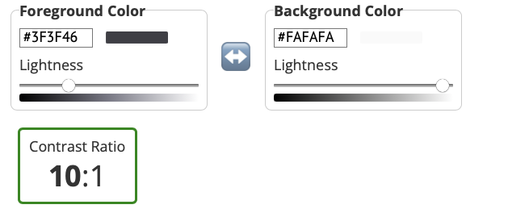

# Accessible TicTacToe

Designing and implementing a website inclusive to screen reader users.

<p align="center">
  
</p>
	
## Requirements
- [x] User should be able to play a tic-tac-toe game
- [x] User should be able to play a tic-tac-toe game with another player simultaneously
- [x] User should be able to create and join tic-tac-toe game rooms
- [x] The website and the application should be accessible for persons with visual impairment
- [x] The website and the application should be accessible for screen reader user with keyboard

---

- The backend should allow:
    - [x] Read, write and consume tic-tac-toe moves
    - [x] Announce the winner
    - [ ] Store tic-tac-toe moves
    - [ ] Retrieve past games and moves

---

# Running on your device

#### Setting up the local database
1. Ensure that you have `MongoDB Community Edition` and its CLI application on your device. For instructions please refer to this 
2. Create a database and give it a name, such as *tic-tac-toe*
3. Keep the database running in the background

#### Setting up the backend
1. Ensure that you have `yarn` or `npm` installed on your device.
2. Clone this repository
3. In the application folder, run `npm install` to install all dependencies.
4. Change your directory to the `server` folder
```
cd AccessibleTicTacToe/server
```
4. The application makes use `.env` file in `server` folder. The following is an example `.env` file
```
MONGO_URL="mongodb://<your-local-host>/<your-databse-name>"
PORT=<your-preferred-port>
CLIENT='http://localhost:<client-port>'
```
5. Run `node index.js` to start your backend server.

#### Setting up the backend
1. In `client` folder, run `npm start`
2. Ensure that the port numbers in `server`‘s `.env` and client’s match. As well as, `config.js` in `client`

The application pre-populates some data in your local database. So, if everything goes well, you should see two rooms already on the webpage.

---

# Architecture and approach

The implementation follows the MERN tech stack

| Area                         | Choice               | What is it?                                       |
| ---------------------------- | -------------------- | ------------------------------------------------- |
| Language                     | Vanilla JavaScript   | General purpose                                   |
| View                         | React + Tailwind CSS | Frontend library for easier CSS                   |
| Backend                      | Express.js           | Reliable Node.js framework                        |
| ORM/ ODM                     | Mongoose             | JS OOP library for MongoDB                        |
| Database                     | MongoDB              | Non-relational database                           |
| Bi-directional communication | Socket.io         | Real-time communication between client and server | 

**Note**: The application is not deployed

### Rationale

I have chosen frameworks and tech stacks that are highly maintained and relevant for this project. *ReactJS* with *tailwind* allows us to customise accessible components quickly. 

For small to medium projects, *Express* is a great choice for our backend server.

*Mongoose* was used on top of *MongoDB* to ensure the type safety of the objects being passed around on REST API, which is especially necessary with vanilla JS to avoid `null` or `undefined` values.

To facilitate real-time communication, *Socket.io* is used. *Socket.io* is an event-driven technology which makes it ideal for games.

As we are working with dynamically structured data, “documents” are more applicable to store our objects. Furthermore, since the players are anonymous and are not keeping any sessions, there is no strong cause for relational databases.

### Design Decisions
>[!NOTE]
>This section refers to visual and accessibility design only

When designing with accessibility in mind, it should be pleasant for both screen readers and visually as vision impairment has varying severity. 

First, the colour scheme chosen should have suitable level of contrast. The same goes for font weights and sizes.

Next, I added `aria-labels` for screen readers to have a better flow and inform them about what the region holds.

Last, I added keyboard support to navigate and play tic-tac-toe.







---

## Assumptions & Interpretations

#### The following assumptions were used to scope the problem:
- Users are able to find and navigate to the site
- Users are already using their pre-existing screen readers
- Users are proficient or at least familiar with their screen readers
- Users know how tic-tac-toe is played**
- Users are mainly playing over web

#### Interpretations
- Game history should only persist in the room

---

## API Endpoints

### Sample API requests

#### Players

```
// get all players
curl -v http://localhost:8800/players
```
Returns
```
[{"_id":"65290aa43e4a9e409dbf01b5","sid":"bb111","username":"Bot Player","__v":0},{"_id":"65290aa43e4a9e409dbf01b6","sid":"aa111","username":"Bot Gamer","__v":0},{"_id":"65291e13a16d47085c5369b3","sid":null,"username":"Warm Bear","__v":0},{"_id":"652920db05c60f7d280fca7c","sid":"ZghFZy-NWUQMbe9-AAAJ","username":"Slow Beaver","__v":0},{"_id":"652920f227a97d245cbb6f28","sid":"TR2EwozuqDf2fFsFAAAD","username":"Stubborn Shark","__v":0},{"_id":"6529221527a97d245cbb6f34","sid":"w3sqirNDlDsdgg2NAAAH","username":"Fuzzy Squirrel","__v":0}]
```

```
// get player and username identified by socketId (sid)
curl -v http://localhost:8800/players/w3sqirNDlDsdgg2NAAAH
```
Returns
```
{"_id":"6529221527a97d245cbb6f34","sid":"w3sqirNDlDsdgg2NAAAH","username":"Fuzzy Squirrel","__v":0}
```

#### Rooms

```
// get all rooms
curl -v http://localhost:8800/rooms
```
Returns
```
[{"_id":"6528d6bc8d4b9ef69caa9361","roomId":"1","players":["6528d6bc8d4b9ef69caa935a","6528d6bc8d4b9ef69caa935b"],"__v":0},{"_id":"6528d6bc8d4b9ef69caa9362","roomId":"2","players":[],"__v":0},{"_id":"652915990922d0fbaf1fa89a","roomId":"264","players":[],"__v":0},{"_id":"6529206105c60f7d280fca6f","roomId":"664","players":[],"__v":0},{"_id":"652920af05c60f7d280fca79","roomId":"390","players":[],"__v":0},{"_id":"6529221527a97d245cbb6f32","roomId":"739","players":[],"__v":0},{"_id":"6529226b27a97d245cbb6f38","roomId":"285","players":[],"__v":0}]
```


```
// get a room identified by roomId
curl -v http://localhost:8800/rooms/1
```
Returns
```
{"_id":"6528d6bc8d4b9ef69caa9361","roomId":"1","players":["6528d6bc8d4b9ef69caa935a","6528d6bc8d4b9ef69caa935b"],"__v":0}
```
---

# Known Bugs

1. Fails to update `Players` attribute of `Room` when a player joins a game.
	- This results in Homepage not correctly rendered.
	- Being able to join full rooms
2. Player can refresh page which does not restart the game but assigns both players the same sign.
	- This is due to the fact that backend logic assigns whoever joins first as `X` and second player as `O`. Therefore, it is possible that there will be 2 `O`s when a player refreshes.
3. You can access a full game via link and interfere with the game
4. It is not set whether `X` or `O` starts first
5. There is no feedback on screen reader when a player tries to place on a taken tile
6. There is no feedback on move made by opponent

---
